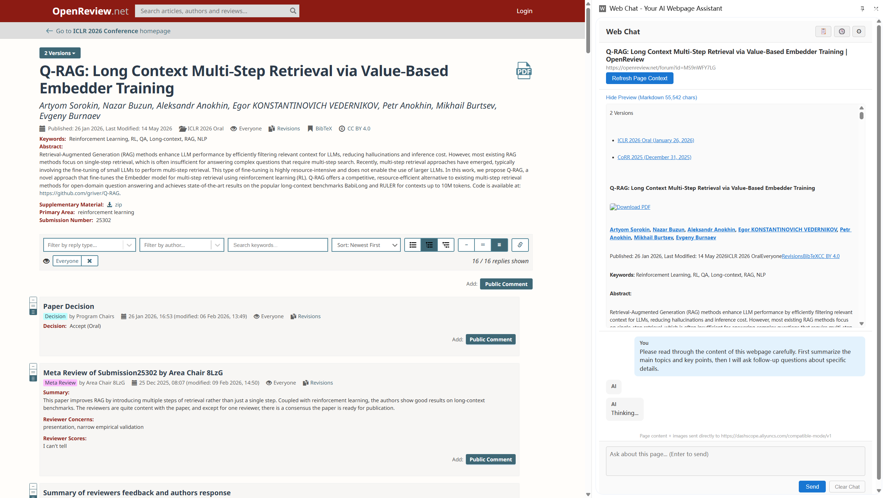
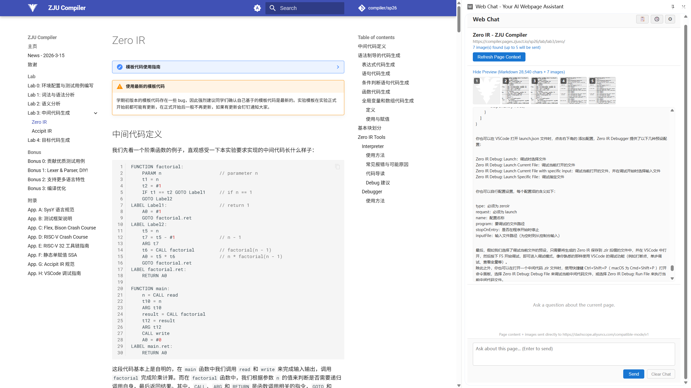
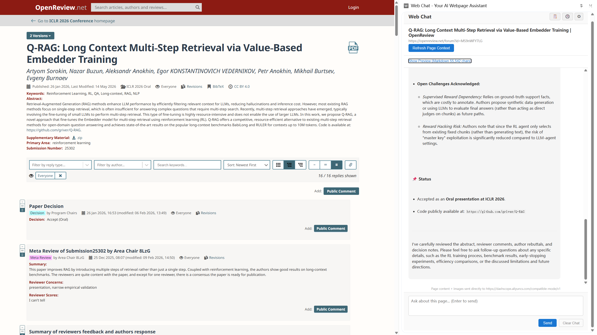
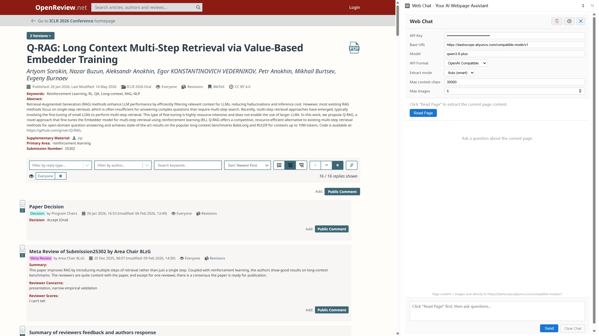
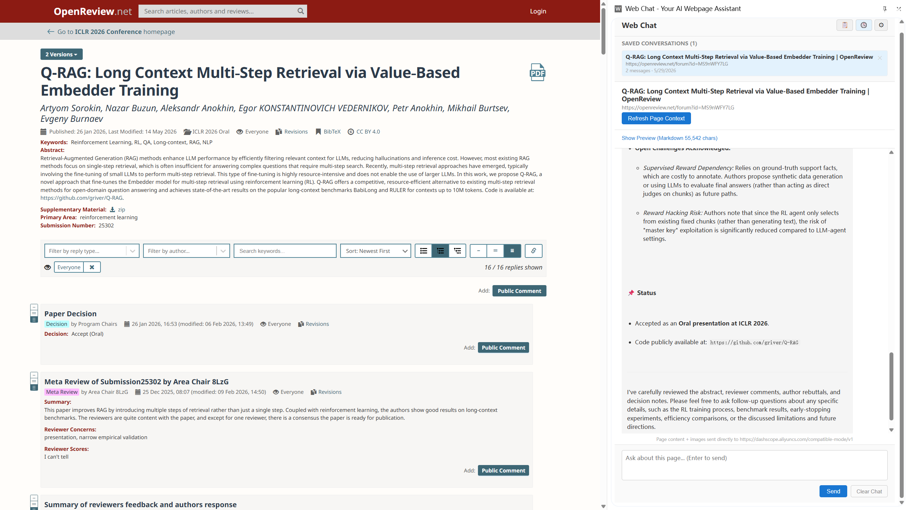
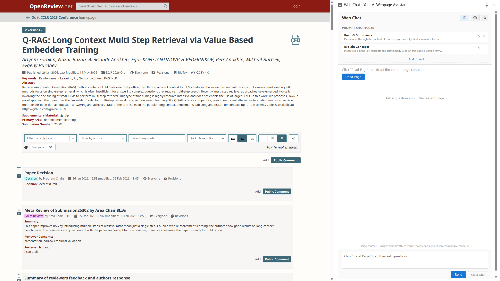

<p align="center">
  
  
  
  
  
</p>

<h1 align="center">Web Chat</h1>
<h3 align="center">Your AI Webpage Assistant</h3>

<p align="center">
  <strong>一键提取，边看边问。</strong><br>
  告别手动复制粘贴 —— 在 Chrome 侧边栏中和 AI 一起阅读任何网页。<br>
  支持智能内容提取、图片识别、对话存档、流式输出。
</p>

---

## 为什么需要 Web Chat？

> *"这篇博客好长，想用 AI 帮我总结，但复制粘贴太累了……"*
>
> *"OpenReview 上这篇 rebuttal 的上下文太多，手动选都选不全……"*
>
> *"这个网站是用法语写的，我完全看不懂，但又需要理解它的内容……"*
>
> *"学长这份实验笔记有几万字，贴到 ChatGPT 里还经常超出长度限制……"*

**这是每个认真阅读网页的人都会遇到的痛点。**

当你面对一个内容密集的网页时，传统的做法是：选中文本 → 复制 → 粘贴到 AI 对话窗口 → 补充说明 → 等待回答。如果还要追问，就得反复复制粘贴。遇到图片、表格，更是无从下手。更糟的是，有些页面结构复杂（学术论坛、实验文档、非母语网站），你甚至不知道哪些内容是关键的。

**Web Chat 彻底改变了这个流程。**

打开网页，点击图标，AI 就在侧边栏里等着你。不用复制粘贴，不用切换窗口，不用反复描述"我正在看这个网页，内容是……"—— 页面内容自动提取，连同图片一起发给 AI。

### 典型场景

| 场景 | 痛点 | Web Chat 的解决方式 |
|---|---|---|
| **OpenReview 论文 & Rebuttal** | 正文分散在多个折叠区，reviewer 评论、作者回复互相交织，手动粘贴极易遗漏关键论点 | 一键提取全页，AI 帮你梳理论点脉络、对比各方观点 |
| **长篇学习笔记 / 实验文档** | 学姐学长的笔记动辄几万字，包含大量上下文和交叉引用，直接贴 AI 会超出长度限制 | 智能截断 + 分段提取，边看边问，AI 始终掌握完整上下文 |
| **非母语网站** | 内容完全看不懂，即使翻译插件逐段翻译也很费劲，且翻译质量参差不齐 | AI 不仅能翻译，还能用你熟悉的语言解释概念、提炼要点 |
| **带有图表的文章** | 图表中蕴含大量信息，纯文本提取完全忽略，需要手动截图上传 | 自动采集页面图片，Vision 模型直接识别图表、公式 |
| **经常回头看的资料页** | 上次已经提问过一轮，重新打开又要从头开始 | 自动存档对话历史，再次访问同一 URL 时一键恢复 |

---

## ✨ 核心能力

<table>
<tr>
<td width="50%">

### 智能提取，告别复制粘贴

一次点击，网页正文自动转换为结构化 Markdown 并发送给 AI。四种提取策略覆盖从博客到 SPA 的所有页面类型。

- **4 种提取模式** — Auto / Readability / Full Page / Plain Text
- **Preview 区实时预览** — 字符数一目了然，确认提取完整再提问
- **Prompt 快捷键** — 常用提问模板一键填入

> *从"手动复制 5 分钟"到"点击 1 秒"*

</td>
<td width="50%">

### 图片识别，视觉问答

自动采集页面中的图片，下载转码后发送给 Vision 模型。AI 不仅能读文字，还能"看懂"图表、截图、公式、架构图。

- 自动过滤头像、图标等无关小图
- 缩略图编号预览 + 点击放大
- 对话中可直接引用 *"Image 2 的表格说明了什么？"*

> *推荐使用 Qwen 3.6 Plus 等多模态模型获得最佳体验*

</td>
</tr>
<tr>
<td width="50%">

### 对话存档，随时回顾

每个网页的对话自动按 URL 归档。再次打开同一页面时，历史记录自动恢复，无需从头开始。

- 最多保存 50 个网页的完整对话上下文
- 历史面板统一浏览，点击即恢复
- 切换网页自动切换上下文

> *好文章值得反复读，好对话不该丢*

</td>
<td width="50%">

### 流式输出，打字机体验

SSE 流式传输，AI 的回答逐字出现在屏幕上，不用等待完整响应 —— 看到第一句话就能开始读。

- 兼容 Anthropic Messages & OpenAI Chat Completions 两种协议
- Markdown 渲染（表格、代码块、公式、引用）
- 支持任意兼容 API 端点（DeepSeek、Qwen、OpenAI、Ollama...）

> *回答到一半就能判断方向对不对*

</td>
</tr>
</table>

---

## 产品预览

<p align="center">
  
</p>

<p align="center">
  <em>一键提取页面内容 — Markdown 预览 + 图片缩略图 + 字符数统计</em>
</p>

<p align="center">
  
</p>

<p align="center">
  <em>图片采集 — 自动过滤头像/图标，缩略图编号预览，点击放大</em>
</p>

<p align="center">
  
</p>

<p align="center">
  <em>AI 流式回答 — Markdown 实时渲染，支持表格、代码块、标题、引用</em>
</p>

<p align="center">
  
</p>

<p align="center">
  <em>设置面板 — API Key / Base URL / Model / 提取模式 / API 格式。 设置提取模式后你可以readpage或者refresh page，并在预览部分观察你所需要的内容是否被捕获。max context chars设置了网页内容字符数上限，max images设置了网站图片上传上限.一般来说auto就可以，如果你发现auto模式下你拿不到完整的内容再切换成full page模式重新读取网站。</em>
</p>

<p align="center">
  
</p>

<p align="center">
  <em>历史面板 — 对话自动按 URL 归档，点击一键恢复</em>
</p>

<p align="center">
  
</p>

<p align="center">
  <em>Prompt 快捷键 — 预置常用提问模板，点击即填入输入框</em>
</p>


<p align="center">
  
</p>
<p align="center">
  <em>完整操作演示：提取页面 → 查看预览 → AI 流式回答 → Markdown 渲染</em>
</p>

---

## 快速开始

### 方式一：直接下载（推荐）

下载 `extension/dist/` 目录，在 Chrome 中加载即可，无需安装任何开发工具。

打开 `chrome://extensions/` → 开启 **开发者模式** → **加载已解压的扩展程序** → 选择 `dist/` 目录

### 方式二：自行构建

```bash
cd extension
npm install
npm run build
```

产物在 `extension/dist/`，同上加载。

### 配置

打开任意网页 → 点击侧边栏齿轮图标 → 填入 API 信息 → 完成

---

## 配置参考

### 推荐：阿里云百炼（支持多模态）

> **DeepSeek API 目前尚未提供图像识别能力。** 如需使用图片识别功能，推荐阿里云百炼平台的 Qwen 系列模型。

| 设置 | 值 |
|---|---|
| Base URL | `https://dashscope.aliyuncs.com/compatible-mode/v1` |
| Model | `qwen3.6-plus` |
| API Format | OpenAI Compatible |
| API Key | [阿里云百炼控制台](https://bailian.console.aliyun.com) 申请 |

### 其他提供商

| 提供商 | Base URL | 推荐模型 | API Format | 图片识别 |
|---|---|---|---|---|
| DeepSeek | `https://api.deepseek.com` | `deepseek-v4-pro` | OpenAI | 暂不支持 |
| DeepSeek | `https://api.deepseek.com/anthropic` | `deepseek-v4-pro` | Anthropic | 暂不支持 |
| Anthropic 官方 | `https://api.anthropic.com` | `claude-sonnet-4-6` | Anthropic | 支持 |
| OpenAI 官方 | `https://api.openai.com/v1` | `gpt-4o` | OpenAI | 支持 |
| Ollama 本地 | `http://localhost:11434` | 你的模型名 | OpenAI | 取决于模型 |

### 提取模式

| 模式 | 场景 | 说明 |
|---|---|---|
| **Auto** | 通用 | 先 Readability，不够自动降级 |
| **Readability** | 博客、新闻 | 算法精准定位正文 |
| **Full Page** | SPA、论坛 | 全页去噪提取 |
| **Plain Text** | 兜底 | 直接采集 DOM 文本 |

### 其他设置

| 设置 | 默认 | 说明 |
|---|---|---|
| API Key | — | 密钥仅存本地 |
| Base URL | `dashscope.aliyuncs.com/.../v1` | 默认百炼，可配任意端点 |
| Model | `qwen3.6-plus` | 支持多模态，推荐 |
| API Format | OpenAI Compatible | 也支持 Anthropic Messages |
| Max Context | 30,000 | 超出截断 |
| Max Images | 5 | 0-20，每张 ≤5MB |

---

## 功能全景

```
┌─────────────────────────────────────────────────────┐
│                    Web Chat                          │
│              Your AI Webpage Assistant               │
├─────────────────────────────────────────────────────┤
│                                                      │
│  📄 内容提取          🖼️ 图片识别                     │
│  ├─ 4 种提取模式      ├─ 自动采集页面图片              │
│  ├─ Markdown 预览     ├─ 缩略图 + 点击放大             │
│  └─ 字符数实时显示    └─ 编号引用，精准提问             │
│                                                      │
│  💬 智能对话          ⚡ 流式输出                      │
│  ├─ 多轮上下文记忆    ├─ 逐字实时呈现                   │
│  ├─ Markdown 渲染     ├─ 支持 Anthropic + OpenAI       │
│  └─ AI 可引用图片     └─ 任意兼容端点                   │
│                                                      │
│  💾 对话存档          🔒 隐私安全                      │
│  ├─ 按 URL 自动归档   ├─ Key 仅存本地                   │
│  ├─ 历史面板浏览      ├─ 用户主动触发才发送              │
│  └─ 一键恢复历史      └─ 直接到 AI，不经过第三方         │
│                                                      │
└─────────────────────────────────────────────────────┘
```

---

## 隐私

- API Key 存储在 `chrome.storage.local`，仅存本地，不同步
- 页面内容仅在点击 **Read Page** + **Send** 后才发送
- 数据直接从浏览器到 AI 提供商，无中间服务器

---

## 技术栈

```
React 18 + TypeScript + Vite
Chrome Extension Manifest V3
marked (Markdown 渲染)
@mozilla/readability (正文提取)
turndown (HTML → Markdown)
```

---

## 许可

MIT License
